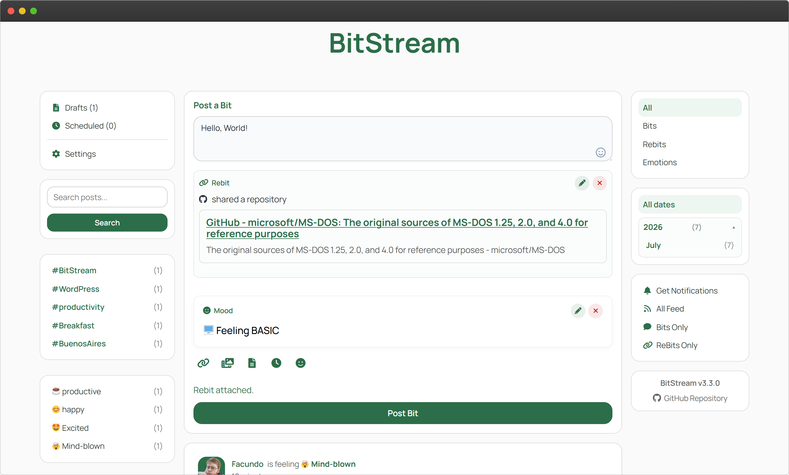
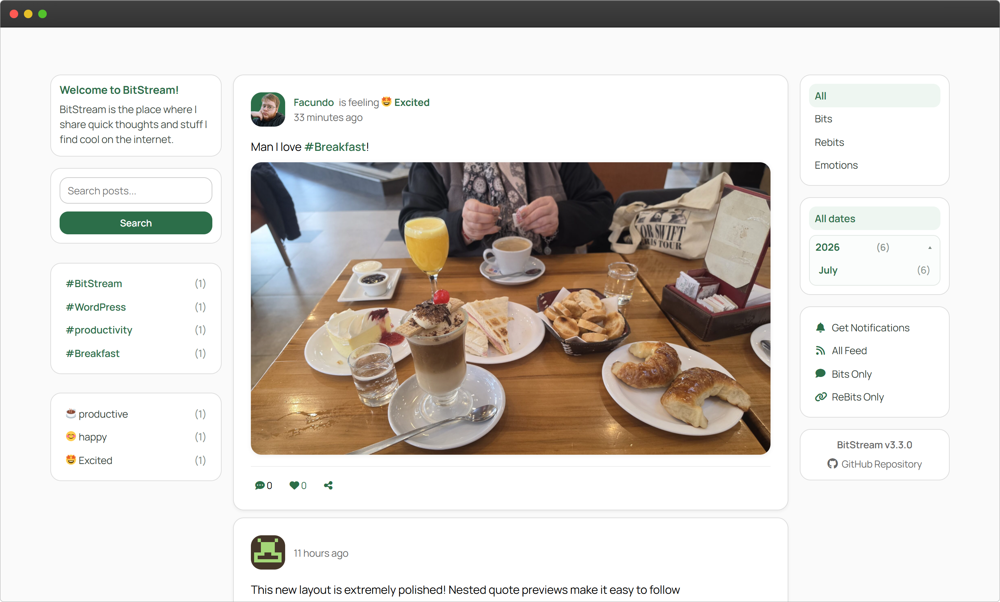
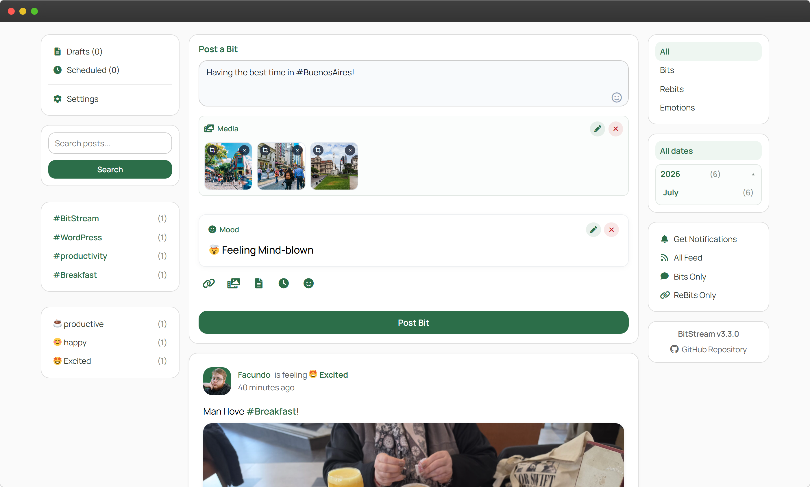
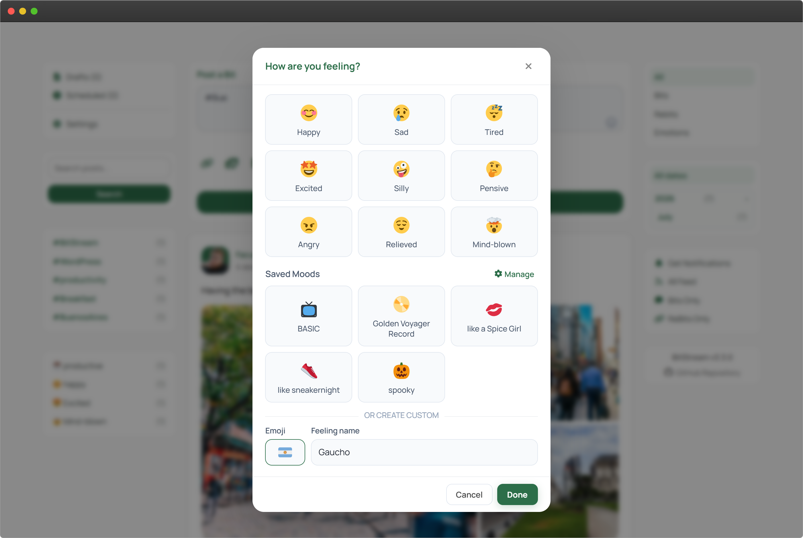
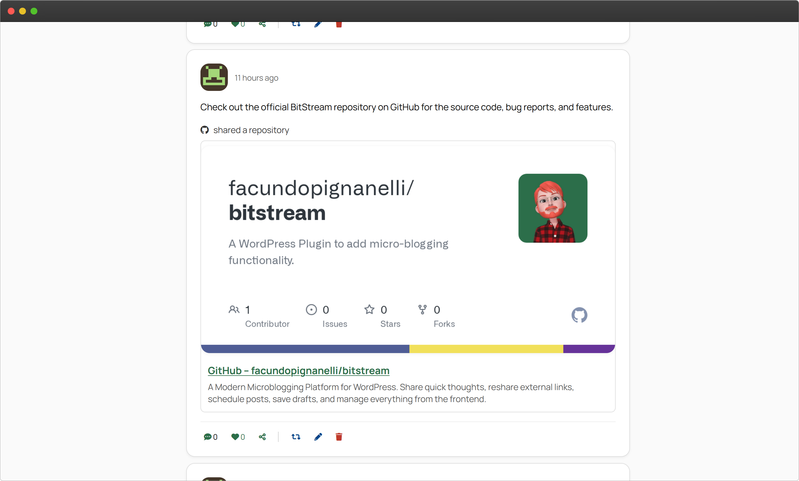
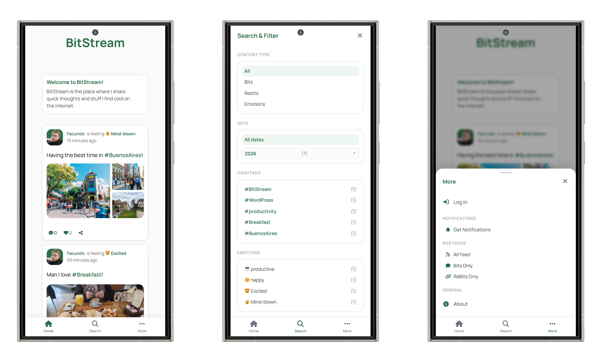
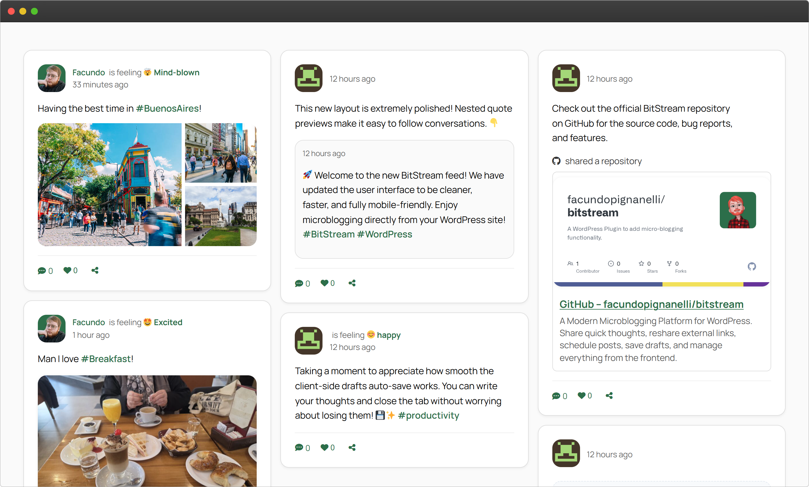
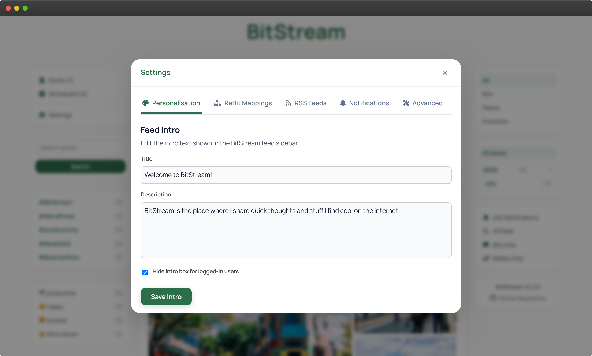

#  BitStream
A Modern Microblogging Platform for WordPress.


**DISCLAIMER: This plugin was primarily created to experiment with AI-generated code. It is unsupported, provided as-is, and I do not recommend using it in production. Because this project was created primarily for experimentation, the code may be incomplete or unstable. Use at your own risk.**

## 🎯 Overview




BitStream transforms WordPress into a powerful, premium microblogging platform with Twitter-like functionality. Share quick thoughts (Bits), reshare external content (ReBits), schedule posts, save drafts, share posts as custom PNG cards, choose and customize your mood, use hashtags, and enjoy a modern, responsive Progressive Web App experience with a clean social-app style timeline.

---

## 📋 Table of Contents

- [Installation](#-installation)
- [Quick Start](#-quick-start)
- [Features](#-features)
- [Shortcodes](#-shortcodes)
- [Progressive Web App](#-progressive-web-app)
- [ReBit System](#-rebit-system)
- [Front-End Administration & Settings](#-front-end-administration--settings)
- [Technical Details](#-technical-details)
- [Contributing](#-contributing)
- [Changelog](#-changelog)

---

## 🚀 Installation

### From GitHub Release
1. Download the latest release from the [releases page](https://github.com/facundopignanelli/bitstream/releases)
2. Upload the `bitstream` folder to `/wp-content/plugins/`
3. Activate the plugin through the 'Plugins' menu in WordPress
4. Visit Settings → Permalinks and click "Save Changes" to flush rewrite rules
5. Create a page and add the `[bitstream]` shortcode

### Manual Installation
1. Clone this repository into your WordPress plugins directory:
   ```bash
   cd wp-content/plugins
   git clone https://github.com/facundopignanelli/bitstream.git
   ```
2. Activate the plugin in WordPress
3. Flush permalinks (Settings → Permalinks → Save Changes)

---

## ⚡ Quick Start

### Display the Feed
Create a new page and add the main shortcode to display your timeline:
```
[bitstream]
```

### Posting Interface
BitStream features an integrated Composer and navigation workspace directly on your main timeline feed. 
- **Desktop**: Embedded inline at the top of the timeline.
- **Mobile**: A persistent bottom navigation bar (`[Home] [Search] [Compose] [Drafts] [More]`) for layout viewports under 1024px. The center-aligned **Compose** button slides up the composer workspace, **Drafts** displays a full-screen drafts view with a red count badge, and **More** launches a bottom drawer sheet for scheduled list, notifications, settings, and the About widget.

### Settings Panel
Manage all configuration options directly on the frontend timeline page via the **Settings** gear link in the mobile More drawer or the desktop sidebar quick links.

---

## ✨ Features

### 🎨 Modern Social Timeline



- **Social-App Style Feed**: Clear, single-column reading experience replacing old masonry layouts.
- **Adaptive Sidebars**: Left navigation and filter links, right Quick Actions rails, and responsive stacking across device breakpoints.
- **Interactive Cards**: Rich media support, quoted bits (nested cards), and inline action buttons (comments, likes, share).
- **Interactive Time Toggles**: Click/tap on relative timestamps (e.g., *2 hours ago*) to dynamically append the exact date and time inline (fully selectable and copyable).
- **Quoted Bits Navigation**: Quoted bit previews are interactive; clicking them filters the feed to isolate that post, displaying an active filter chip to easily clear and return to the full feed.
- **Deep-Linked Highlight View**: Direct links containing the `highlight_bit` parameter filter the timeline to show only the targeted post. Features an active filter chip at the top to clear the view and return to the full timeline.

### 📝 Composer Interface



- **Unified Feed Composition**: Compose Bits and ReBits directly from the feed page.
- **Drafts & Auto-Save**: Save posts as drafts, auto-save drafts on page or tab close via `navigator.sendBeacon`, and manage draft items directly on the frontend.
- **Robust Scheduling**: Plan ahead with a native datetime picker for future publishing (Bits and ReBits).
- **Rich Media Grids**: Drag-and-drop uploads, attaching up to 10 images or videos per post, custom image cropper, and video support.
- **Fullscreen Lightbox**: Pop up gallery view allowing users to zoom in and expand single or multi-media images and videos directly from the timeline.
- **Hashtag Suggestions Autocomplete**: Type `#` inside the composer or edit modals to receive immediate suggestions of previously used hashtags sorted by count, featuring keyboard navigation (`ArrowUp`/`ArrowDown`/`Enter`/`Tab`) and a mobile-friendly inline stacked layout.
- **Rich Emoji Insertion**: Integrated custom emoji picker triggers inside the composer and edit form textareas, placing a subtle shortcut inside the text fields for seamless rich emoji composition.
- **Timeline Edit Modal Quote Support**: Editing a post that quotes another bit displays the quoted bit preview block inside the edit modal, and allows users to easily clear/remove the quote.

### 🎭 Mood Status Selector



- **Custom Mood Badges**: Select or create a status update in the format `[User Name] is feeling [emoji] [emotion]` next to your name in timeline posts.
- **Pure Mood Posts**: Distinctive large card status blocks in the timeline for mood-only updates (posts with no body text or attachments).
- **Personal Moods Library**: Build a custom saved moods library saved in user profile options. Reorder (Up/Down), delete, or edit custom moods inside the Mood Modal with real-time UI propagation.
- **Emoji Standardization**: Integrates `jdecked/twemoji` to dynamically convert text emojis into uniform SVG vector assets from CDN, ensuring identical emoji displays across Windows, macOS, Android, and iOS.
- **Custom Emoji Picker**: Includes a responsive, styled emoji picker featuring Unicode category tabs, instant country/flag/name search, skin tone preferences, and recently used emojis. The picker automatically scales to the width of its parent modal on desktop and mobile, caches rendering grids in memory for instant tab switching, and has a local fallback cache to ensure it loads even when the CDN is offline.
- **Validation**: Enforces valid Unicode emojis with full support for complex compound ZWJ sequences (skin tones, gender signs, flags).

### 🔗 Enhanced ReBit System



- **Secure OpenGraph Fetcher**: Built-in strict SSRF protection (`wp_safe_remote_get`), timeout retries, URL resolution, and JSON-LD parsing.
- **Fast Previews**: 24-hour transient caching minimizes external requests for ReBit data.
- **Manual Overrides**: Edit the fetched title, description, and image directly in the composer before publishing.
- **Auto-ReBit Detection**: Paste a URL into the composer feed box and it automatically detects the link and configures ReBit options.

### 📤 Premium Sharing Options


- **Unified Share Modal**: Click the share icon on any feed card to choose between:
  - **Share Link**: Triggers native OS share sheet (mobile PWA) or copies the URL to the clipboard.
  - **Share as Image**: Generates a pixel-perfect, branded PNG card of the post with a custom watermark and full timestamp, optimized at 1000px wide for social media (e.g., Instagram Stories).
- **Share Image Cache**: Dedicated administrative option to flush the cached PNG share files from disk and refresh card renders.

---

## 📱 Progressive Web App (PWA)



BitStream is designed as a first-class, offline-aware Progressive Web App:
- **Installable**: Installs as a standalone native app on Android, iOS, Windows, and macOS.
- **Deep-linking Support**: Dynamic handling of internal URLs so links to specific bits or timeline pages open directly in the installed PWA.
- **Subdirectory Isolation**: Scope and start URL resolution dynamically scale to support WordPress instances installed in subdirectories.
- **Android Share Target**: Share photos, videos, or links from other apps directly to BitStream using the OS share sheet.
- **Upload Progress Tracker**: Client-side PWA share upload progress tracking using IndexedDB and Service Worker redirection, replacing the native browser splash screen with visual upload feedback.
- **Service Worker Caching**: Caches static assets, FontAwesome CDN assets, webfont files, and core stylesheets to avoid reload latency.

### 🔔 Push Notifications
- **Payload-Free Dispatch**: Low-resource push dispatch that wakes the service worker to fetch the latest post details dynamically, bypassing complex payload encryption.
- **Self-Hosted VAPID**: Secured using OpenSSL VAPID key pairs generated directly on your server.
- **Three-Stage Permission Flow**: Handles OS/browser notification blocks gracefully:
  1. `default`: Triggers the browser's native permission request dialog.
  2. `granted`: Subscribes the device immediately.
  3. `denied`: Reflects a clear "Notifications Blocked" state with a tooltip explaining how to restore permissions in browser settings.

---

## 📝 Shortcodes



### `[bitstream]` - Display Feed
The main shortcode for displaying your microblog timeline. For logged-in users with publishing permissions, it automatically integrates the inline Composer at the top of the feed (on desktop) and enables the persistent mobile Bottom Navigation Bar (on mobile) to compose, search, manage drafts, and access settings or drawer options.

| Parameter | Type | Default | Description |
|-----------|------|---------|-------------|
| `posts_per_page` | integer | 10 | Number of posts to load per page |
| `limit` | integer | - | Limit total posts (disables pagination in preview mode) |
| `exact_limit` | integer | - | Render exactly this number of posts in preview mode instead of auto-filling to a cap |
| `mode` | string | - | Set to `"preview"` for a compact 3-column grid without sidebars |
| `infinite_scroll` | boolean | false | Enable infinite scroll |
| `show_load_more` | boolean | true | Show/hide load more button |

---

## 🎛️ Front-End Administration & Settings



To keep the WordPress admin clean and focus the application frontend, BitStream 3.0+ completely removes WordPress Admin settings pages in favor of a unified frontend **Settings Modal** (accessible from the quick actions menu or the mobile bottom navigation More drawer):

- **Personalisation**: Customize theme accent colors, toggle display preferences (avatars, comments, likes), toggle visibility of the welcome intro box for logged-in users, and manage display names/bio.
- **ReBit Mappings**: Define custom labels and Font Awesome icons for your most shared platforms (e.g., YouTube, GitHub) using a responsive card-based layout.
- **RSS Feeds**: Manage dedicated RSS feeds for all bits, original bits only, or ReBits only.
- **Push Notifications**: Generate server-side VAPID keys, toggle notifications, and subscribe/unsubscribe devices.
- **Advanced Tools**: View/clear error logs, execute a "Force App Update" (clears SW CacheStorage and re-registers the PWA), or purge the shared image PNG cache files.
- **Housekeeping**: Automatic weekly cron cleanup (`bitstream_weekly_media_cleanup_event`) to prune unattached media files from incomplete uploads.

---

## 🔧 Technical Details

### Architecture & Files
The codebase is written in object-oriented PHP and modern JavaScript/CSS:
- **Core Controller**: [bitstream.php](bitstream.php)
- **Shortcode Definitions**: [class-shortcodes.php](includes/class-shortcodes.php)
- **PWA & Manifest Manager**: [class-pwa-manager.php](includes/class-pwa-manager.php) and [sw.js](/sw.js)
- **AJAX Router**: [class-ajax-handlers.php](includes/class-ajax-handlers.php)
- **Styles & Layout**: [bitstream.css](assets/css/bitstream.css)

### Requirements
- **WordPress**: 5.8 or higher
- **PHP**: 7.4 or higher (with `openssl` and either `imagick` or `gd` extensions enabled)
- **SSL/HTTPS**: Required for PWA features and Web Push Notifications to function (except on `localhost`)
- **Font Awesome**: Recommended for icons (free version)

---

## 🤝 Contributing

**Important:** This project is an experiment in AI-assisted development and does not accept pull requests.

### Why No PRs?
BitStream was created specifically to explore and test AI coding tools and advanced agentic systems. The entire codebase has been generated through AI-assisted development. Accepting traditional pull requests would compromise the experimental nature and learning goals of this project.

### But You Can Still Contribute!
While we don't accept PRs, you're welcome to:
- **Fork the repository** and create your own version
- **Add features** you'd like to see
- **Report bugs** via GitHub Issues
- **Suggest features** through GitHub Discussions

---

## 📄 License

This project is licensed under the GPL v2 or later License.

---

## 📜 Changelog

For a detailed history of versions and changes, see [CHANGELOG.md](CHANGELOG.md).