#  BitStream
A Modern, High-Performance Microblogging Platform for WordPress.


**DISCLAIMER: This plugin was primarily created to experiment with AI-generated code. It is unsupported, provided as-is, and I do not recommend using it in production. Because this project was created primarily for experimentation, the code may be incomplete or unstable. Use at your own risk.**

---

## 🎯 Overview


**BitStream** transforms any WordPress site into a modern, full-featured microblogging social platform. It combines Twitter/Bluesky-style timelines, rich link and social bookmarking (ReBits), native Instagram and X embeds, an inline modal-free composer with contenteditable micro-editing and caret-anchored autocomplete, interactive mood statuses with haptic drag-and-drop customization, branded canvas card export, fullscreen media galleries, and a standalone Progressive Web App (PWA) with Web Share Target and Web Push notifications.

---

## 📋 Table of Contents

- [Quick Start](#-quick-start)
- [Installation](#-installation)
- [Key Features](#-key-features)
  - [Modern Social Timeline](#-modern-social-timeline)
  - [Modal-Free Inline Composer](#-modal-free-inline-composer)
  - [Contenteditable Micro-Editor](#-contenteditable-micro-editor)
  - [Floating Mood Reaction Popover & Edit Mode](#-floating-mood-reaction-popover--edit-mode)
  - [Enhanced Social Embeds (ReBits)](#-enhanced-social-embeds-rebits)
  - [ReBit Mappings Hub & Presets](#-rebit-mappings-hub--presets)
  - [Unified Composer Edit & Quoting Workflows](#-unified-composer-edit--quoting-workflows)
  - [Fullscreen Lightbox & Smart Media Grids](#-fullscreen-lightbox--smart-media-grids)
  - [Branded Canvas Social Share Cards](#-branded-canvas-social-share-cards)
  - [Mobile Experience & Progressive Web App](#-mobile-experience--progressive-web-app)
- [Shortcodes & Embed Widgets](#-shortcodes--embed-widgets)
- [Front-End Administration & Settings](#-front-end-administration--settings)
- [Technical Architecture & Testing](#-technical-architecture--testing)
- [Contributing](#-contributing)
- [License & Changelog](#-license--changelog)

---

## ⚡ Quick Start

### 1. Display the Feed
Create a new WordPress page (e.g. `/bitstream/`) and add the primary shortcode:
```text
[bitstream]
```

### 2. Desktop vs. Mobile Layout
- **Desktop**: An inline composer lives permanently at the top of your feed, complemented by a left-hand navigation sidebar (intro, active tag filters, emotion filters) and a right-hand utility rail (RSS feeds, notifications, admin settings).
- **Mobile (< 1024px)**: The interface switches to a dedicated 3-button bottom navigation bar (`[Home] [Search] [More]`) paired with a center-aligned floating Compose button (**FAB**). Tapping Compose opens a full-viewport slide-up screen. Tapping Search opens a slide-up search and hashtag filtering screen. Tapping More reveals a slide-up drawer with drafts, scheduled items, RSS feeds, and settings.

### 3. Frontend Settings Access
Administrators can configure themes, domain mappings, push notifications, and maintenance tools directly on the frontend by clicking the gear icon in the desktop sidebar or the mobile **More** drawer.

---

## 🚀 Installation

### From GitHub Release
1. Download the latest release `.zip` from the [Releases Page](https://github.com/facundopignanelli/bitstream/releases).
2. Upload the `bitstream` folder to `/wp-content/plugins/` (or install via **Plugins → Add New → Upload Plugin**).
3. Activate the plugin through the WordPress admin panel.
4. Go to **Settings → Permalinks** and click **Save Changes** to flush rewrite rules.
5. Create a page with `[bitstream]` and start posting!

### Manual Installation (Development)
```bash
cd wp-content/plugins
git clone https://github.com/facundopignanelli/bitstream.git
```
Flush rewrite rules in WordPress (`wp rewrite flush` or via Settings → Permalinks).

---

## ✨ Key Features

### 🎨 Modern Social Timeline

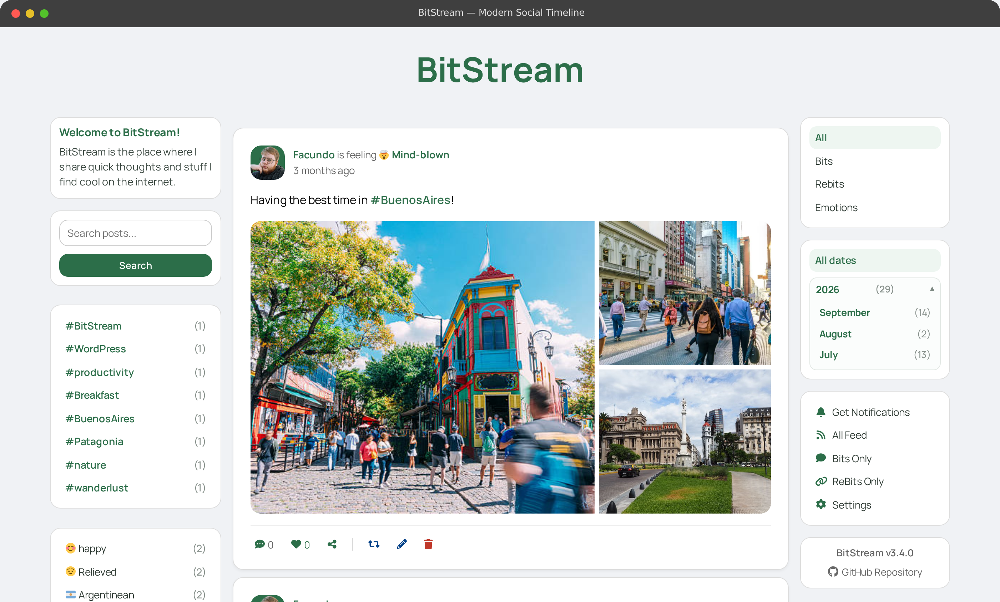

- **Single-Column Feed**: An elegant, readable social stream that replaces clunky masonry grids with clean post cards.
- **Interactive Timestamp Toggles**: Click or tap any relative timestamp (*"2 hours ago"*) to smoothly append the exact, selectable, and copyable date/time (*"Sep 26, 2026, 3:45 PM"*).
- **Dual-Voter Like Tracking**: Visitors and authenticated members can like bits. Logged-in accounts are tracked by user ID while anonymous visitors are tracked via salted IP hashes in `_bitstream_liked_by` postmeta, preventing duplicate vote inflation without requiring logins.
- **Deep-Linked Highlight View**: Opening a URL with `?highlight_bit=ID` isolates that targeted post at the top of the feed with an active dismissal chip, making it simple to share links to specific bits.
- **Image Theft Protection**: Built-in drag-start, context-menu, and CSS selection shields prevent casual copying of timeline imagery.

---

### 📝 Modal-Free Inline Composer

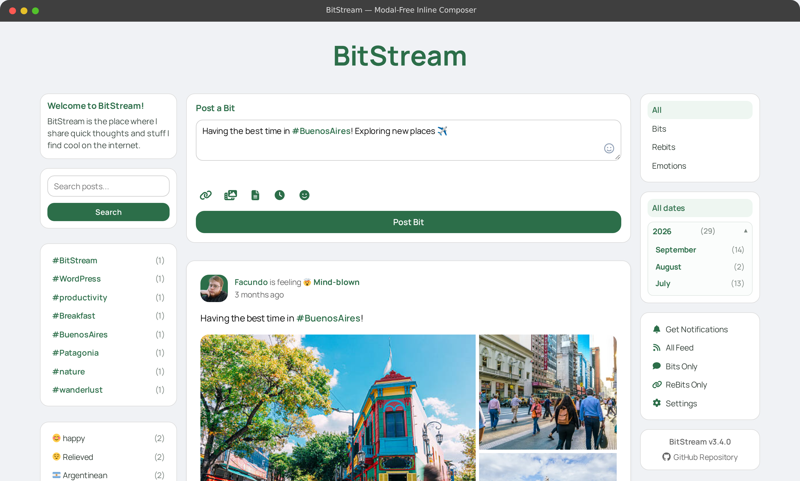

- **Header Drafts & Scheduled Pills**: Direct 1-tap pill badges in the composer header display active counts (`Drafts (2)`, `Scheduled (1)`), auto-hiding smoothly when counts reach zero.
- **Anchored Popover Architecture**: Eliminates heavy nested modal dialogs. Clicking **Link**, **Media**, **Schedule**, or **Mood** opens focused, compact popover menus anchored directly to their respective toolbar triggers.
- **Drag-and-Drop & Clipboard Image Paste**: Drop image/video files directly onto the composer box, or press `Ctrl+V` / `Cmd+V` to paste an image straight from your clipboard. Pasted media is uploaded immediately with progress feedback and attached to your draft.
- **Smart Scheduling**: Set future publication dates with an intuitive datetime picker. Scheduled bits are handled by WordPress cron and tracked in the scheduled posts drawer.
- **Zero-Loss Draft Protection**: Post drafts are auto-saved locally and synchronized with the database. Unloading or refreshing the page triggers `navigator.sendBeacon` to ensure unsaved thoughts are never lost.

---

### ✍️ Contenteditable Micro-Editor

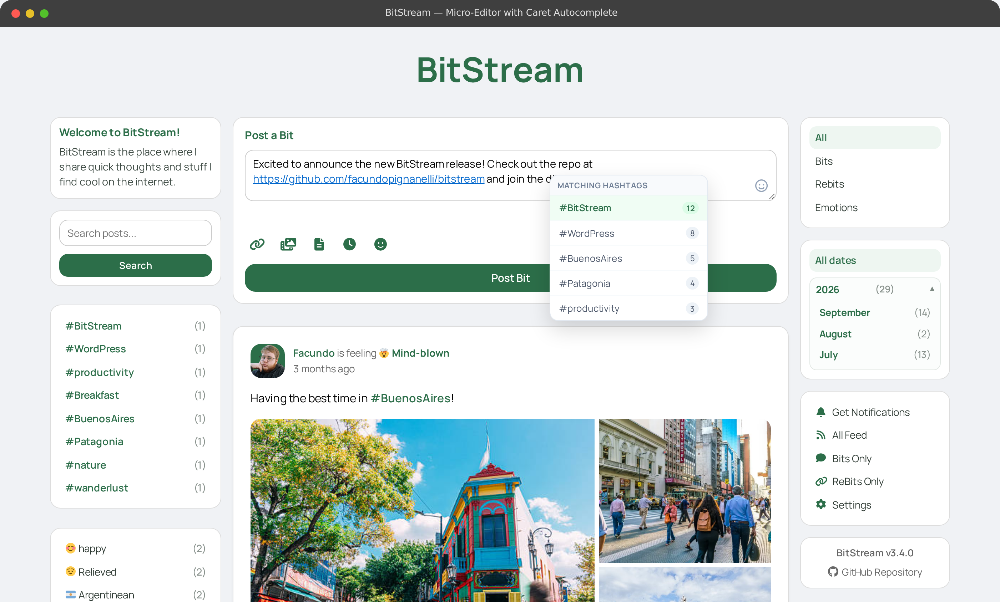

- **Live Syntax Highlighting**: As you type, `#hashtags` are styled dynamically in your theme accent color, while `http://` and `https://` URLs are underlined in blue.
- **Caret-Anchored Autocomplete**: Type `#` anywhere in your text to trigger a floating suggestion popover positioned dynamically at your cursor (`Range.getBoundingClientRect()`). Navigate matching tags with `ArrowUp`, `ArrowDown`, `Enter`, or `Tab`.
- **Inline Twemoji Rendering**: Emojis typed or inserted convert instantly into crisp SVG vector assets (`jdecked/twemoji`), guaranteeing uniform appearance across Android, iOS, Windows, and macOS.
- **Security & Sanitization**: Strict HTML entity escaping prevents DOM XSS, backed by an intelligent plain-text clipboard sanitizer for cross-browser reliability.

---

### 🎭 Floating Mood Reaction Popover & Edit Mode

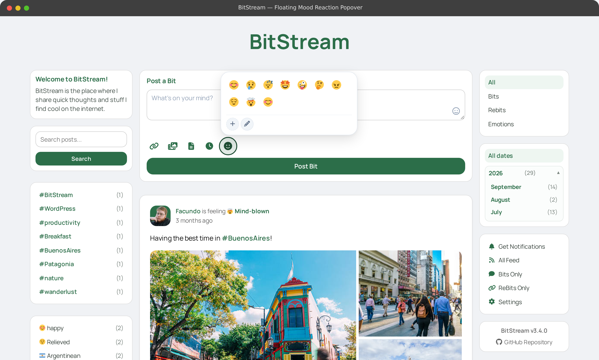

- **320px Reaction Popover**: Clicking the smiley button pops up a clean 320px floating reaction palette anchored above the composer toolbar. Select any mood with 1 click, or click the selected mood again to toggle it off.
- **Dedicated ✏️ Edit Mode**: Tap the pencil icon to enter interactive Edit Mode:
  - **Desktop Drag-and-Drop**: Reorder your favorite moods using native HTML5 drag-and-drop.
  - **Mobile Touch Reordering**: Touch drag with native haptic vibration feedback (`navigator.vibrate` pulses on pick-up and drop) and real-time floating finger-lift translation (`translate3d` 44px above fingertip) for clear visibility while dragging.
  - **In-Place Editing**: Click any mood to update its emoji or emotional feeling label.
  - **Instant Deletion & 5-Second Undo**: Delete moods with instant `×` badges, backed by a 5-second Undo toast and non-blocking background server synchronization.
- **Pure Mood Status Posts**: Publishing a post with a mood and no text or media automatically styles it as a distinctive, large status card in the feed.
- **Batch Database Propagation**: Modifying custom mood labels automatically propagates the update across all historical posts via a single batch SQL query.

---

### 🔗 Enhanced Social Embeds (ReBits)

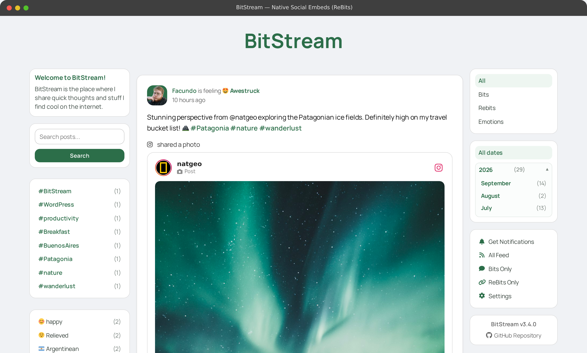

- **Native Instagram Cards (Posts, Reels & Stories)**: Rich, high-fidelity card embeds for `instagram.com` URLs:
  - Preserves natural aspect ratios (1:1 square, 4:5 portrait, and landscape).
  - High-res profile avatar enclosed in Instagram's signature gradient story ring.
  - Type badges (`📷 Post`, `🎬 Reel`, `⭕ Story`) with a frosted-glass play icon overlay on Reels.
  - Clean caption extraction with like/comment preambles automatically removed.
  - Direct action buttons (*"View on Instagram"*, *"Watch Reel on Instagram"*).
- **Native X / Twitter Embeds**: Clean, responsive cards featuring author avatars, verified badges, `@handle`, snowflake-derived exact timestamps, formatted tweet text, and full image galleries without third-party iframe overhead.
- **Dynamic Action Remapping**: Path-aware headers automatically reflect what you shared (e.g. *"shared a photo"*, *"shared a reel"*, *"shared a story"*, *"shared a Tweet"*, *"shared a video"*).
- **Secure OpenGraph Scraper**: Built-in SSRF protection (`wp_safe_remote_get`), 24-hour transient caching, and manual title/description/image overrides prior to publishing.

---

### 🎛️ ReBit Mappings Hub & Presets

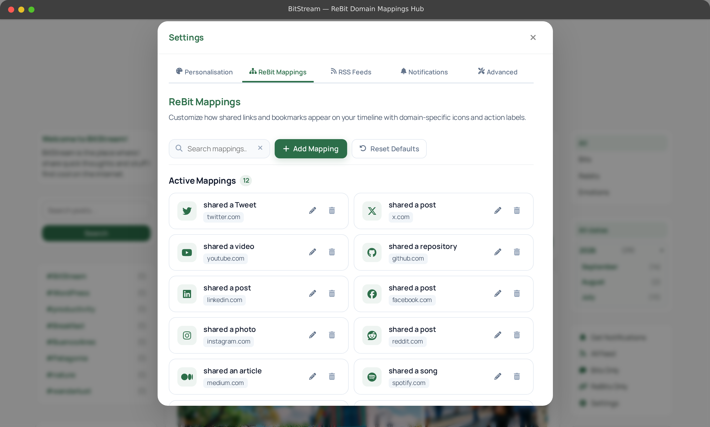

- **Unified Master-Detail Hub**: Configure domain labels and icons via a frontend card grid.
- **Real-Time Search**: Filter mapped domains instantly by hostname or label.
- **1-Click Popular Presets**: Add pre-configured mappings for YouTube, Twitter/X, GitHub, Spotify, and Discord with one click.
- **Curated Icon Popover**: Pick Font Awesome icons with an in-place popover featuring search and category filters.
- **Undoable Deletions**: Deleting domain mappings triggers a 5-second Undo toast before changes commit.

---

### 🔄 Unified Composer Edit & Quoting Workflows

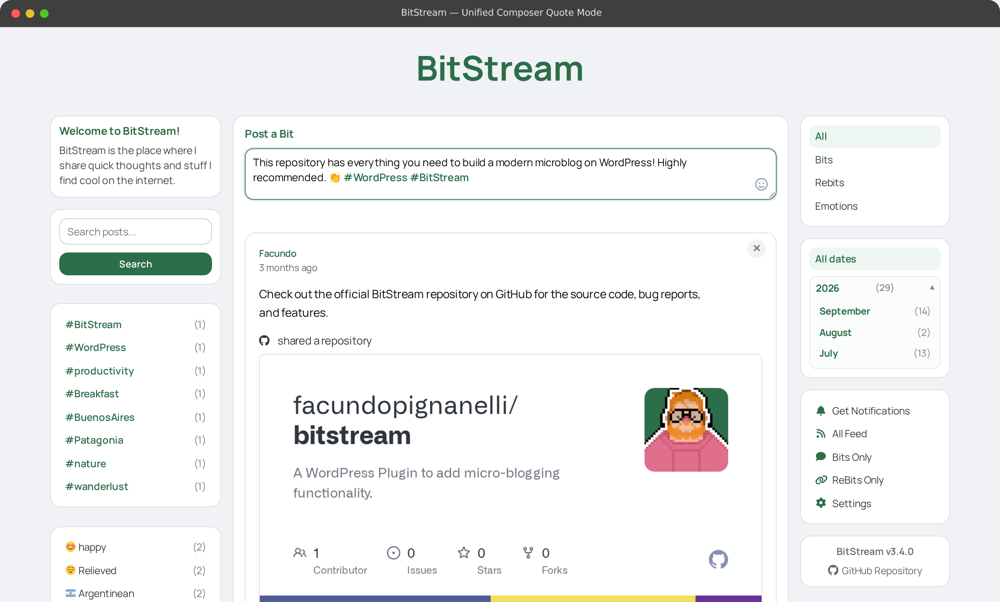

- **One Composer for Everything**: Separate edit modal dialogs have been retired. Clicking **Edit Bit** or **Quote Bit** loads the post directly into the primary composer.
- **Clear State Indicators**: An accent banner (*"Editing Bit #1024"* or *"Quoting Bit #1024"*) indicates the active mode, while the submission button updates dynamically to *"Update Bit"* or *"Quote Bit"*.
- **Safe Draft Stashing**: If you have an unsaved draft in progress, entering Edit or Quote mode automatically stashes your draft in memory and restores it when you cancel or complete your edit.
- **Nested Quoted Cards**: Quotes are rendered inside the quoting card with full author info, timestamp, media, and interactive navigation.

---

### 🖼️ Fullscreen Lightbox & Smart Media Grids

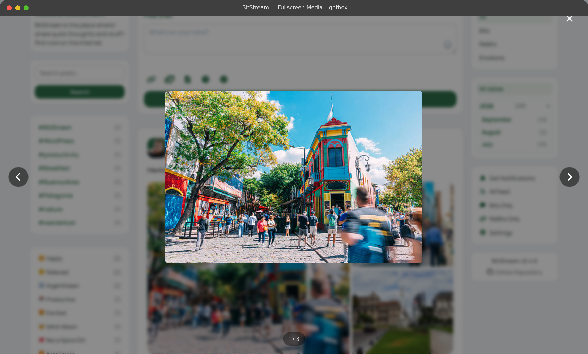

- **Multi-Attachment Grids**: Attach up to 10 images or videos per post, automatically organized into responsive symmetrical and asymmetrical layouts.
- **Fullscreen Lightbox**: Click any media item to open a distraction-free gallery viewer with keyboard arrow navigation (`←` / `→`), touch swipe gestures, and counter badges (`1 / 3`).
- **Canvas Image Cropper**: Crop images prior to posting with standard aspect ratios (`1:1`, `4:5`, `16:9`).
- **EXIF & Privacy Scrubbing**: Automatically strips GPS coordinates, camera metadata, and IPTC tags on upload via `Imagick` (with `GD` fallback).

---

### 📤 Branded Canvas Social Share Cards

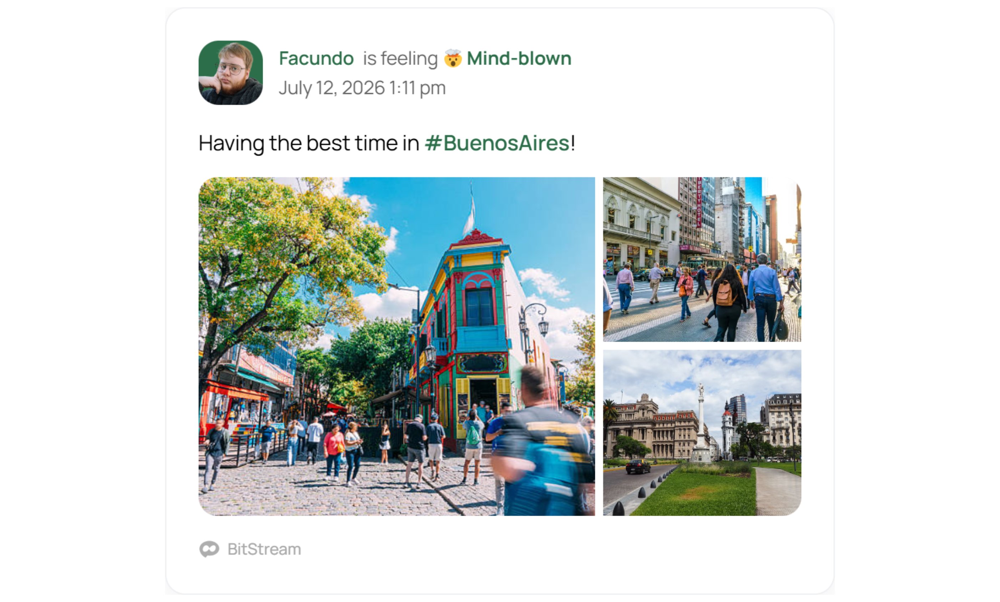

- **Anchored Share Popover**: Click the share icon on any bit to open a compact menu offering **Share Link** or **Share as Image**.
- **1000px Social Image Export**: Uses an HTML5 canvas renderer to generate a pixel-perfect, branded 1000px PNG card featuring author avatar, post text, media, timestamp, and site watermark. Perfect for Instagram Stories or cross-platform sharing.
- **Automatic Cache Invalidation**: Editing a bit or quoted post automatically clears cached share card files from disk.

---

### 📱 Mobile Experience & Progressive Web App

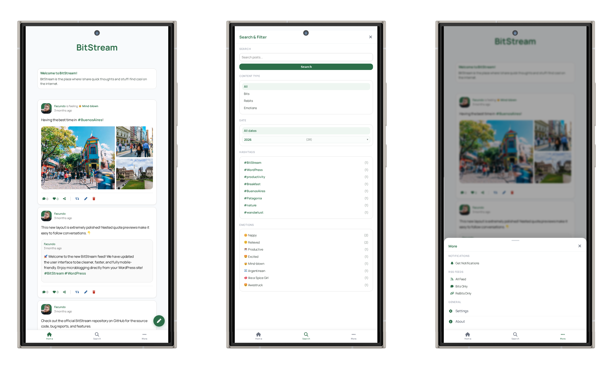

- **Mobile Navigation Bar**: A balanced 3-button bottom bar (`Home`, `Search`, `More`) paired with a center floating **Compose FAB**.
- **Screen vs. Modal UI Metaphor**:
  - *Primary tasks* (Composing, Search, Drafts, Scheduled Posts) render as full-viewport slide-up screens (`bitstreamMobileModalIn`).
  - *Sub-task pickers* (Link URL, Media type, Schedule datetime, Mood palette) render as spring-animated floating modals (`bitstreamModalIn`).
- **PWA Web Share Target**: Share photos, videos, links, or text directly from other mobile apps (Gallery, Safari, Chrome, YouTube) into BitStream via your device's native share sheet.
- **Web Push Notifications**: Server-side VAPID key generation with a 3-stage permission workflow (`default`, `granted`, `denied`).

---

## 🧩 Shortcodes & Embed Widgets

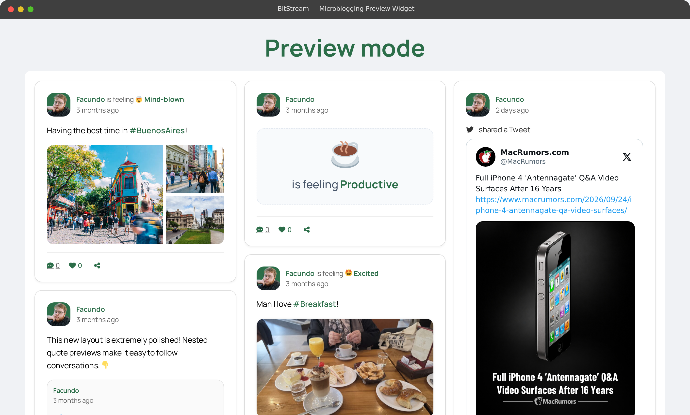

### `[bitstream]` — Primary Timeline
Embeds the full interactive microblog feed.

| Parameter | Type | Default | Description |
|---|---|---|---|
| `posts_per_page` | integer | `10` | Number of bits loaded per batch |
| `infinite_scroll` | boolean | `false` | Automatically fetch subsequent posts on scroll |
| `show_load_more` | boolean | `true` | Display manual "Load More" pagination trigger |
| `mode` | string | `""` | Set to `"preview"` for a compact embed widget |
| `limit` | integer | `null` | Total maximum posts to load |
| `exact_limit` | integer | `null` | Strict limit override (disables infinite scroll / pagination) |

### Preview Mode: `[bitstream mode="preview" limit="8"]`
Renders a clean, responsive 3-column card grid without sidebars, composer, or administrative actions. Ideal for landing pages, user profiles, or side-widget embeds.

### Settings Shortcode: `[bitstream_settings]`
Renders the standalone administrative settings dashboard on any dedicated page.

---

## 🎛️ Front-End Administration & Settings

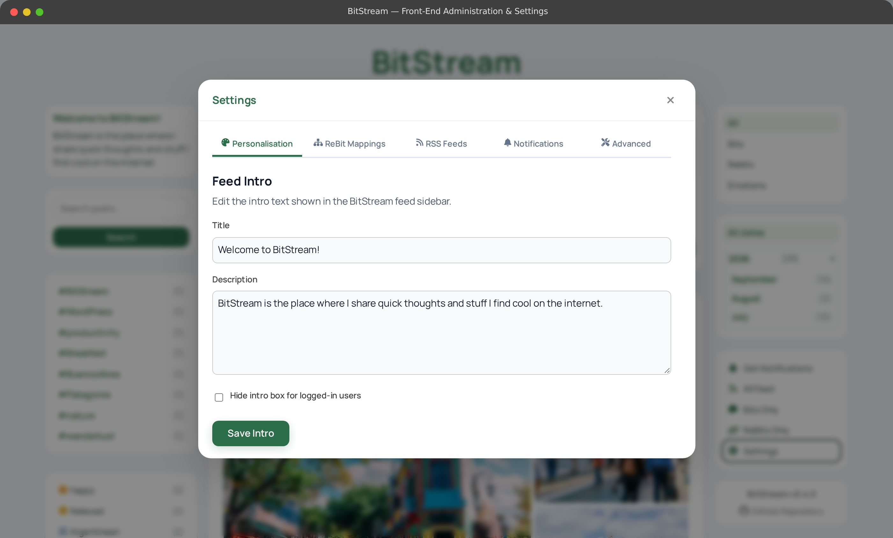

BitStream keeps the WordPress WP-Admin uncluttered by placing configuration into a unified frontend modal:

- **Personalisation**: Theme accent colors, comment/like visibility, intro banner toggle, avatar controls.
- **ReBit Mappings**: Custom host labels, domain aliases, and Font Awesome icon assignments.
- **RSS Syndication**: Dedicated feeds for `/feed/bits/`, `/feed/rebits/`, and emotion tags.
- **Push Notifications**: Generate OpenSSL VAPID keys and manage device subscriptions.
- **Advanced Tools**: Live error log inspector, Force App Update (purges PWA CacheStorage), and PNG share cache purger.
- **Automated Housekeeping**: Scheduled weekly cron (`bitstream_weekly_media_cleanup_event`) automatically purges abandoned draft media.

---

## 🏗️ Technical Architecture

### Modular Codebase Structure
- **Core Controller**: [bitstream.php](bitstream.php) — Bootstraps constants, lifecycle hooks, and helper wrappers.
- **Custom Post Type**: [includes/class-post-type.php](includes/class-post-type.php) — Registers `bit` CPT, daily auto-titling (`Bit #YYYY-MM-DD:001`), and SQL metadata search.
- **Display Engine**: [includes/class-content-display.php](includes/class-content-display.php) — Card markup rendering, nested quote cards, and hashtag linking.
- **AJAX Controller**: [includes/class-ajax-handlers.php](includes/class-ajax-handlers.php) — Asynchronous endpoints for posting, cropping, uploading, and draft saving.
- **OpenGraph Scraper**: [includes/class-og-fetcher.php](includes/class-og-fetcher.php) — SSRF-safe URL scraper with Twitter/Instagram embed parsers.
- **PWA Manager**: [includes/class-pwa-manager.php](includes/class-pwa-manager.php) & [sw.js](sw.js) — Service worker lifecycle, Web Share Target, and VAPID push notifications.
- **Client Modules**:
  - [assets/js/bitstream.js](assets/js/bitstream.js) — Lightweight bootstrap router.
  - [assets/js/bitstream-composer.js](assets/js/bitstream-composer.js) — Inline composer, popovers, and edit/quote state machine.
  - [assets/js/bitstream-editor.js](assets/js/bitstream-editor.js) — Contenteditable micro-editor with hashtag autocomplete.
  - [assets/js/bitstream-timeline.js](assets/js/bitstream-timeline.js) — Feed scrolling, share popovers, and timestamp toggling.
  - [assets/js/bitstream-uploader.js](assets/js/bitstream-uploader.js) — Multi-part chunked media uploader.
  - [assets/js/bitstream-lightbox.js](assets/js/bitstream-lightbox.js) — Fullscreen media gallery.
  - [assets/js/bitstream-cropper.js](assets/js/bitstream-cropper.js) — Canvas-based image cropper.
  - [assets/js/bitstream-settings.js](assets/js/bitstream-settings.js) — ReBit mappings hub and frontend settings.

---

## 🤝 Contributing

**Important: This project is an experiment in AI-assisted development and does not accept pull requests.**

The entire codebase has been developed through advanced autonomous AI coding agents. Accepting manual PRs would bypass the experimental integrity and evaluation metrics of the project. You are warmly encouraged to:
- **Fork the repository** and customize your own instance.
- **Open GitHub Issues** to report bugs or unexpected behavior.
- **Join GitHub Discussions** to share feature ideas and feedback.

---

## 📄 License & Changelog

- **License**: Released under the [GNU General Public License v2.0 or later](https://www.gnu.org/licenses/gpl-2.0.html).
- **Changelog**: Comprehensive release notes and version history are maintained in [CHANGELOG.md](CHANGELOG.md).